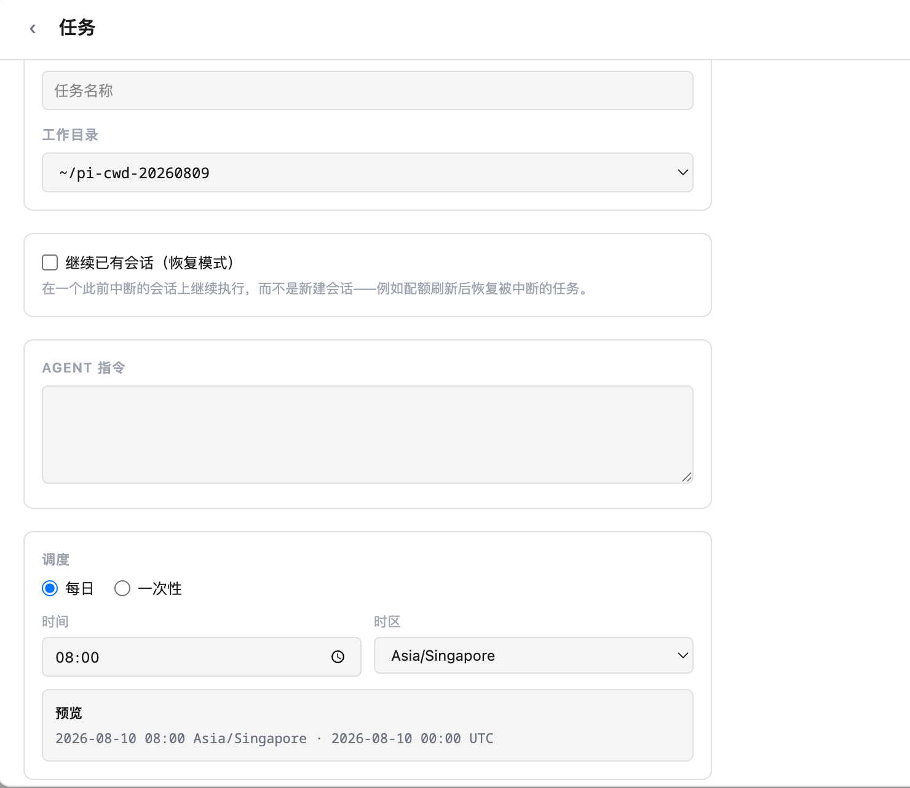
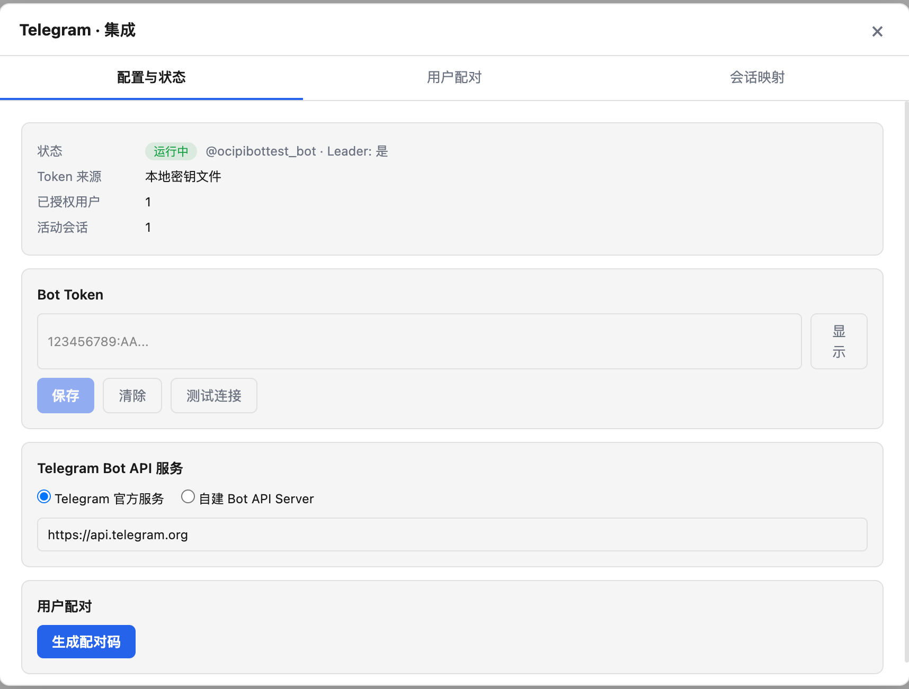
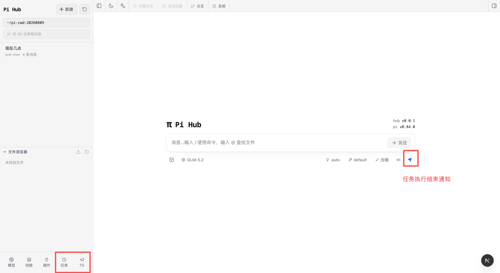

# Pi Web

[English](./README.md) | [简体中文](./README.zh-CN.md) | [Русский](./README.ru.md)

[pi コーディングエージェント](https://github.com/earendil-works/pi) のローカルブラウザー UI です。Pi Web は pi と同じローカル設定とセッションファイルを使用し、ブラウザーから会話の検索と再開、エージェントの実行、モデルやリソースの設定、プロジェクトファイルの確認を行えます。


## 機能

- **セッションワークスペース**：プロジェクトごとに会話を閲覧、再開、名前変更、エクスポート、削除し、実行状態、コンテキスト使用量、コスト、コンパクション情報を確認できます。
- **2 種類の分岐**：**New session** は以前のメッセージから独立したセッションファイルを作成し、**Edit from here** は現在のセッション内にブランチを作成します。
- **プロジェクトファイルツール**：ファイルの閲覧とアップロード、Git Diff の確認、ソース、Markdown、画像、音声、PDF、DOCX のプレビューに対応し、変更時は自動更新されます。
- **Git worktree**：同じリポジトリのセッションをまとめたまま、サイドバーからチェックアウトを切り替えられます。
- **Web での設定**：Pi Web を離れずに、Provider のログインと API Key、モデル、モデルテスト、プラグインパッケージ、スキルを管理できます。
- **英語と簡体字中国語の UI**：初回はブラウザーの言語に従い、トップバーから言語を切り替えられます。

## クイックスタート

Pi Web には Node.js 22.19.0 以降が必要です。`node --version` でバージョンを確認してから、次を実行します：

```bash
npx @jarome/pi-hub@latest
```

サーバーの準備が整うと、CLI はブラウザーを自動的に開こうとします。開かない場合は [http://127.0.0.1:30141](http://127.0.0.1:30141) にアクセスしてください。Pi Web はデフォルトで `127.0.0.1` のみをリッスンします。

モデル Provider が未設定の場合は、**Models** パネルを開いてログインするか API Key を追加してください。

`pi-web` コマンドをグローバルにインストールする場合：

```bash
npm install -g @jarome/pi-hub
pi-hub
```

続いて [http://127.0.0.1:30142](http://127.0.0.1:30142) を開きます。サーバーの準備が整うと、CLI はブラウザを自動的に開こうとします。Pi Web はデフォルトで `127.0.0.1` のみをリッスンします。

## 設定

ポートとホスト名では、コマンドラインオプションが対応する環境変数より優先されます。`--no-open` と `PI_WEB_NO_OPEN=1` は、どちらを指定してもブラウザーの自動起動が無効になります。

| オプションまたは環境変数 | 用途 | デフォルト |
| --- | --- | --- |
| `--port <port>`、`-p <port>`、または `PORT` | サーバーポート | `30141` |
| `--hostname <host>`、`-H <host>`、または `PI_WEB_HOSTNAME` | バインドするホスト名 | `127.0.0.1` |
| `--no-open` または `PI_WEB_NO_OPEN=1` | ブラウザーを自動的に開かない | 自動的に開く |
| `PI_WEB_ALLOWED_HOSTS` | 追加で許可するプロキシまたはカスタムホスト名。複数指定はカンマ区切りで完全一致 | 未設定 |
| `PI_WEB_PASSWORD` | HTTP Basic Auth を有効化。ユーザー名は常に `pi` | 認証なし |

例：

```bash
pi-hub --port 8080              # カスタムポート
pi-hub --hostname 0.0.0.0       # 信頼できるネットワークに公開
pi-hub -p 8080 -H 0.0.0.0       # オプションを組み合わせる
pi-hub --no-open                # ブラウザを自動的に開かない

PORT=8080 pi-hub                # 環境変数にも対応
PI_HUB_HOSTNAME=0.0.0.0 pi-hub  # ネットワーク公開を明示的に有効化
PI_HUB_ALLOWED_HOSTS=pi-hub.internal pi-hub  # プロキシまたはカスタムホスト名を許可
PI_HUB_PASSWORD='十分に長いランダムなパスワード' pi-hub  # Basic Auth を有効化（ユーザー名: pi）
PI_HUB_NO_OPEN=1 pi-hub         # バックグラウンドサービスとして実行する場合に便利
```

> 環境変数は `PI_HUB_`（推奨）と `PI_WEB_`（上流の pi-web との後方互換性のためのレガシー名）のどちらのプレフィックスも使用できます。

`PI_HUB_PASSWORD` を設定すると、Web インターフェースとすべての API エンドポイントが HTTP Basic Auth で保護されます。ユーザー名は常に `pi` です。未設定または空の場合、認証は無効です。

Pi Web は高権限のエージェントを呼び出せます。Basic Auth は転送中のパスワードを暗号化しないため、平文 HTTP をインターネットに公開しないでください。リモートアクセスには、信頼できるリバースプロキシによる HTTPS または信頼できる VPN を使用してください。
API リクエストでは、loopback 名、IP リテラル、選択したバインドホスト名、および `PI_HUB_ALLOWED_HOSTS` にカンマ区切りで指定した完全一致のホスト名のみを受け入れます。信頼できるリバースプロキシが異なる外部ホスト名を使用する場合は、この変数を設定してください。

```bash
PI_WEB_PASSWORD='十分に長いランダムなパスワード' pi-web --hostname 0.0.0.0
```

Basic Auth は転送中のパスワードを暗号化しません。平文 HTTP で Pi Web をインターネットに公開せず、信頼できるリバースプロキシによる HTTPS または信頼できる VPN を使用してください。リバースプロキシが外部ホスト名を転送する場合は、その名前を完全一致で `PI_WEB_ALLOWED_HOSTS` に追加します。この許可リストは Pi Web のバインド先を変更しません。

### HTTP プロキシ

サーバー側のモデルリクエストと API リクエストは、標準の `HTTP_PROXY`、`HTTPS_PROXY`、`NO_PROXY` 環境変数を使用します。

macOS または Linux：

```bash
HTTP_PROXY=http://127.0.0.1:7890 \
HTTPS_PROXY=http://127.0.0.1:7890 \
NO_PROXY=localhost,127.0.0.1 \
npx @jarome/pi-hub@latest
```

Windows PowerShell：

```powershell
$env:HTTP_PROXY = "http://127.0.0.1:7890"
$env:HTTPS_PROXY = "http://127.0.0.1:7890"
$env:NO_PROXY = "localhost,127.0.0.1"
npx @jarome/pi-hub@latest
```

## Pi Hub の拡張機能

Pi Hub は、従来の Pi Web のセッション管理とブラウザワークスペースに、Telegram 連携とスケジュール実行機能を追加しています。関連する実装は `modules/scheduler/`、`modules/telegram/`、`app/api/scheduler/`、`app/api/integrations/telegram/` にあります。

### スケジュールタスク

サイドバーの「タスク」から、作業ディレクトリと Agent の指示を設定し、実行方法を選択できます。

- **毎日**：指定した時刻とタイムゾーンで繰り返し実行します。
- **一度だけ**：指定した日時に一度だけ実行します。
- **既存セッションを継続**：復元モードを選ぶと新しいセッションを作成せず、既存のセッションから続行できます。長期タスクの定期的なフォローアップに便利です。

タスク画面では、保存前に次回実行時刻を選択したタイムゾーンと UTC の両方で確認できます。



### Telegram 連携

Pi Hub では Telegram Bot Token を設定し、Telegram 公式 Bot API または自前の Bot API Server を選択できます。ユーザーのペアリングとセッションマッピングを設定すると、Telegram ユーザーを Pi Hub のセッションに関連付け、Telegram から Agent セッションを継続できます。

スケジュールタスクの開始、成功、失敗、遅延リトライなどの状態は Telegram に通知できます。通知にはタスク情報とセッション ID が含まれるため、あとから対象セッションを確認して操作できます。



メイン画面の TG エントリから Telegram 連携の状態を確認できます。タスク終了後は通知エントリから実行結果も確認できます。



## 機能

- **作業をすぐに再開**：セッションのパスやターミナル履歴を探さずに、プロジェクトごとに過去の pi の会話を閲覧できます。
- **別の方向性を安全に試す**：以前のメッセージから続けるか、セッションをフォークして別の進め方を試せます。
- **ブランチをまたいで作業**：サイドバーから Git worktree を切り替えると、新しいセッションと Explorer が選択したチェックアウトに追従します。
- **プロジェクトを見ながらチャット**：エージェントの作業中に、左側でファイルを閲覧し、右側でソース、ドキュメント、画像、音声、PDF をプレビューできます。
- **セッションの状態を明確に把握**：コンテキスト使用量、コスト、コンパクション状態、システムプロンプトの詳細をトップバーで確認できます。
- **ターミナルでの設定を削減**：モデル、ログイン／API キー、モデルテスト、スキルの切り替えを Web UI から管理できます。

## 注意事項

- **エージェントデータ**：Pi Web はデフォルトで `~/.pi/agent` の pi データを読み込みます。セッションファイルは `sessions/<encoded-cwd>/<timestamp>_<uuid>.jsonl` にあります。別の pi エージェントディレクトリを使用するには `PI_CODING_AGENT_DIR` を設定してください。
- **ファイルシステムへのアクセス**：Pi Web はエージェントデータディレクトリと、セッションに記録された作業ディレクトリを読み取れる必要があります。既存の pi セッションを共有する場合は、pi と同じファイルシステム環境で Pi Web を実行してください。
- **共有設定**：Models パネルは pi のモデル、設定、認証情報ストレージを使用するため、変更は両方のインターフェースに反映されます。
- **ファイルアクセスの範囲**：ファイルブラウザーは、Pi Web で選択した作業ディレクトリと、既知のプロジェクトまたはセッションルートに限定されます。汎用のファイルシステムブラウザーではありません。
- **Git worktree**：スイッチャーの表示条件、worktree の作成、削除時の動作については [Worktrees in Pi Web](./docs/worktrees.md) を参照してください。

## 開発

```bash
npm install
npm run dev
```

ローカル開発サーバーは [http://127.0.0.1:30142](http://127.0.0.1:30142) で動作します。

よく使うチェック：

```bash
npm test
node_modules/.bin/tsc --noEmit
npm run lint
```

通常の開発中は `next build` または `npm run build` を実行しないでください。`.next/` に書き込まれ、開発サーバーに影響する可能性があります。ビルドはリリース作業時にのみ実行してください。

コントリビューター向けガイド：[Internationalization](./docs/i18n.md) と [Release process](./docs/release.md)。

## リポジトリ構成

```text
app/
  api/
    agent/          # AgentSession を作成・操作し、SSE イベントを公開
    auth/           # OAuth と API キーの管理
    cwd/validate/   # カスタム作業ディレクトリの検証
    default-cwd/    # pi のデフォルト作業ディレクトリを取得
    files/          # ファイルの一覧、読み込み、プレビュー、監視
    home/           # 現在のユーザーのホームディレクトリ
    models/         # 利用可能なモデル、デフォルトモデル、思考レベル
    models-config/  # models.json の読み書きとモデルのテスト
    sessions/       # セッションの読み込み、名前変更、削除、コンテキスト、HTML エクスポート
    skills/         # スキルの一覧、検索、インストール、有効化／無効化
components/
  AppShell.tsx        # メインレイアウト、URL 状態、上部パネル、ファイルタブ
  SessionSidebar.tsx  # プロジェクト選択、セッションツリー、Explorer
  ChatWindow.tsx      # メッセージ、SSE、画像のドラッグ＆ドロップ、ミニマップ
  ChatInput.tsx       # 入力欄、モデル／ツール／思考／コンパクション／スラッシュコントロール
  MessageView.tsx     # メッセージ、思考、ツール呼び出し／結果の表示
  ModelsConfig.tsx    # モデルと認証の設定パネル
  SkillsConfig.tsx    # スキル管理パネル
  FileExplorer.tsx    # ファイルツリー
  FileViewer.tsx      # ソース、差分、画像、音声、PDF、DOCX のプレビュー
lib/
  http-dispatcher.ts  # サーバー側 fetch の HTTP(S) プロキシ設定
  rpc-manager.ts      # AgentSessionWrapper のライフサイクルとグローバルレジストリ
  session-reader.ts   # .jsonl セッションファイルとブランチコンテキストの解析
  normalize.ts        # toolCall フィールド名の正規化
  file-access.ts      # ファイル読み込みの安全境界
  file-paths.ts       # ファイルパスのエンコードと相対パスのヘルパー
  markdown.ts         # Markdown／Mermaid／KaTeX プラグインの設定
  pi-types.ts         # pi 関連の型
hooks/
  useAgentSession.ts  # セッションの読み込み、コマンド送信、SSE ステートマシン
  useAudio.ts         # 完了通知音
  useDragDrop.ts      # 画像のドラッグ＆ドロップ
  useTheme.ts         # テーマの切り替え
bin/
  pi-hub.js           # npm CLI エントリポイント
instrumentation.ts    # サーバー HTTP ディスパッチャーの初期化
```

アーキテクチャの説明と詳細なファイルマップについては [AGENTS.md](./AGENTS.md) を参照してください。

## ライセンス

[MIT](./LICENSE)
